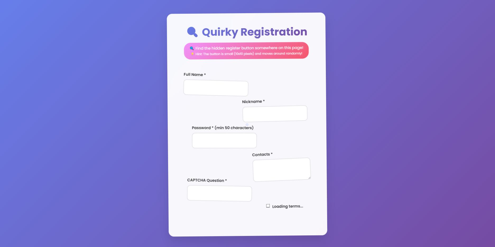
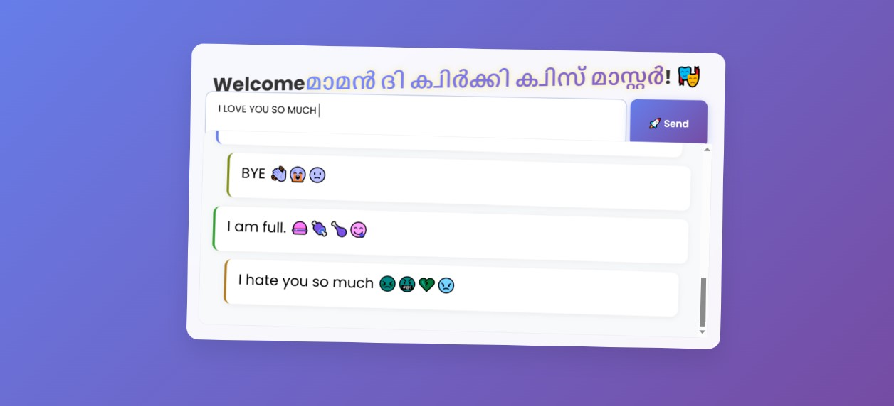

## Emojify
### Team Name: Trash  

### Team Members  
- Team Lead: Alvi A V – [Christ College of Engineering]  
- Member 2: Alin Alex – [Christ College of Engineering]  

### Project Description  
A completely quirky web application with hidden features, weird interactions, and lots of surprises! This app is designed to be fun, annoying, and entertaining — the kind of app your friends will *love to hate*.  

### The Problem (that doesn't exist)  
People register on websites too easily these days. There’s no *real challenge*. Also, online conversations are too straightforward — where’s the chaos?  

### The Solution (that nobody asked for)  
Make a registration page that’s *painfully* hard to fill out:  
- Input fields randomly jump around the screen while you’re typing.  
- The “Register” button is a tiny 10x10 pixel nightmare to click.  
And once you finally get in, enjoy a chatroom where everything you say gets flipped into its opposite meaning and sprinkled with random emojis — courtesy of the Gemini Flash 1.5 API.  

---

## Technical Details  

### Technologies/Components Used  

**For Software:**  
- **Languages:** HTML, CSS, JavaScript  
- **Frameworks:** None (pure chaos, pure fun)  
- **Libraries:** None — except Gemini API SDK  
- **Tools:** Node.js, Render (hosting)  

**For Hardware:**  
- None — unless you count your mouse (good luck clicking that button).  

---

### Implementation  

**For Software:**  

#### Installation  
```bash
git clone https://github.com/your-username/trash.git
cd trash
npm install
```

#### Run  
```bash
node server.js
```
Then open `http://localhost:3000` in your browser.  

---

### Project Documentation  

  



### Project Demo  

  
- Live link on Render: [https://emojify-5q71.onrender.com/]  

---

---

Made with ❤️ (and chaos) at TinkerHub Useless Projects  

  
  
